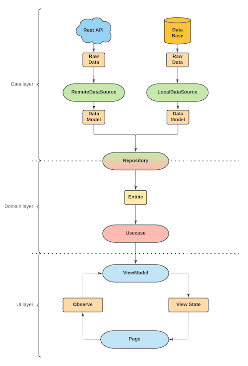
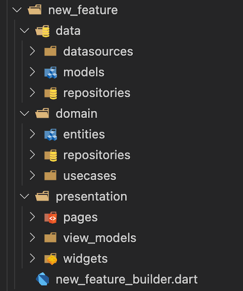

<!-- 
This README describes the package. If you publish this package to pub.dev,
this README's contents appear on the landing page for your package.

For information about how to write a good package README, see the guide for
[writing package pages](https://dart.dev/guides/libraries/writing-package-pages). 

For general information about developing packages, see the Dart guide for
[creating packages](https://dart.dev/guides/libraries/create-library-packages)
and the Flutter guide for
[developing packages and plugins](https://flutter.dev/developing-packages). 
-->

### Welcome to the Disposable package
It's a simple interface to manage all instances that needs to been disposed.

### Example
```dart
import 'dart:async';
import 'package:disposer/disposer.dart';

class DataSource with Disposable {
    final streamController = StreamController.broadcast();
    
    @override
    void dispose() {
        streamController.close();
    }
}

```

### Multilevel dependencies example:
```dart
import 'dart:async';
import 'package:disposer/disposer.dart';


void main() {
  final LocalDataSource localDataSource = LocalDataSource();
  final RemoteDataSource remoteDataSource = RemoteDataSource();
  final DataRepository dataRepository = DataRepository(
    localDataSource: localDataSource,
    remoteDataSource: remoteDataSource,
  );
  final DataUsecase dataUsecase = DataUsecase(repository: dataRepository);
  dataUsecase.dispose();

  // Output:
  /*
    [log] LocalDataSource Disposed
    [log] RemoteDataSource Disposed
    [log] DataRepository Disposed
    [log] DataUsecase Disposed
  */
}

class LocalDataSource with Disposable {
  final streamController = StreamController.broadcast();

  @override
  void dispose() {
    streamController.close();
    super.dispose();
  }
}

class RemoteDataSource with Disposable {
  final streamController = StreamController.broadcast();

  @override
  void dispose() {
    streamController.close();
    super.dispose();
  }
}

class DataRepository with Disposable {
  DataRepository({
    required this.localDataSource,
    required this.remoteDataSource,
  });

  @override
  List<Disposable> get disposables => [
        localDataSource,
        remoteDataSource,
      ];

  final LocalDataSource localDataSource;
  final RemoteDataSource remoteDataSource;
}

class DataUsecase with Disposable {
  DataUsecase({
    required this.repository,
  });

  @override
  List<Disposable> get disposables => [
        repository,
      ];

  final DataRepository repository;
}

```
## Feature generator
### Future generator creates new clean architecture feature:

### Folders structure:


## Start working with future generator
### First approach
Activate the global pub package. With this approach, you can use features generator globally

Activate:
  ```console
    dart pub global activate disposer
  ```

Usage:
  ```console
    disposer --name NewFeature --output lib/src/features
  ```

### Second approach
Add disposer like dependency to your project
```yaml
  dependencies:
    disposer: ^0.0.7
```

Usage:
```console
  flutter pub run disposer --name NewFeature --output lib/src/features
```
    
Feature naming convention:
```console
    -n example
    --name example
    -n Example
    --name Example
    -n ExampleFeature
    --name ExampleFeature
```
Output parameter is optional. Default path is: `lib/features`.

Example:
```console
    -o lib/src/features
    --output lib/src/features
```
    
